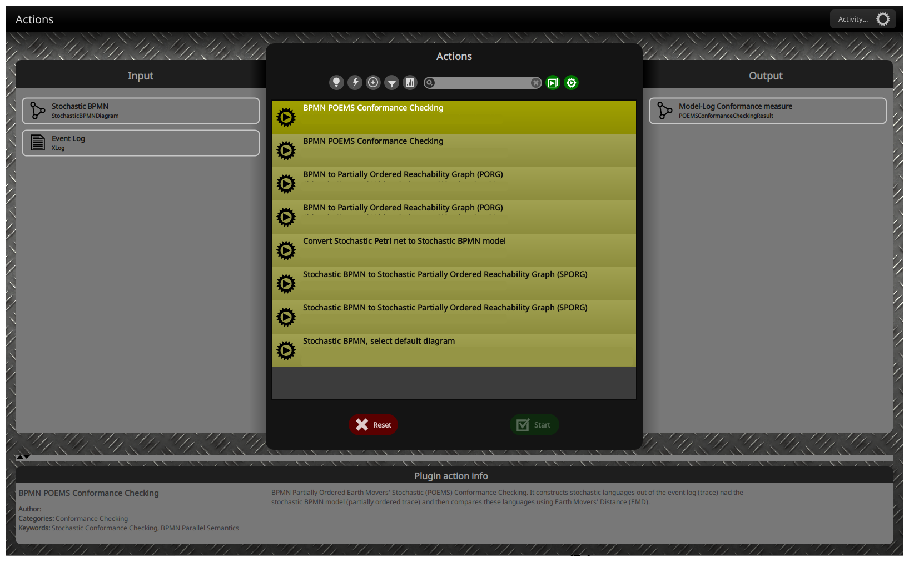

# Stochastic BPMN and Their Conformance
Partially Ordered Earth Movers' Stochastic (POEMS) Conformance Checking for BPMN
## What is it?

The first stochastic conformance checking method for BPMN is implemented as a package in [ProM](https://promtools.org/).

- Stochastic-aware conformance checking.
- Formal definition and specification extension of the BPMN standard with stochastic perspective. See [SBPMN ProM GitHub package repo](https://github.com/promworkbench/StochasticBPMN).

## Usage
This method has two main inputs: a stochastic BPMN and an event log.
Acquiring the event log (XES) is a standard procedure in the Process Mining community.
To learn more about the format of the stochastic BPMN and how to acquire it, please refer to the [SBPMN ProM GitHub package repo](https://github.com/promworkbench/StochasticBPMN).
### In ProM


### Java
Very basic usage with default configuration.
```java
BpmnPoemsConformanceChecking poems = BPMNStochasticConformanceChecking.poems();
POEMSConformanceCheckingResult result = poems.calculateConformance(sBpmnDiagram, xlog);
Double conformanceValue = result.conformanceValue(); // A value between 0 and 1
```
#### Advanced Usage
For more advanced usage, check out the `BpmnPoemsConformanceChecking` interface and the `getInstance` factory methods provided there.

Since this approach is based on sampling behavior from the Stochastic BPMN model, you can use this class to configure the sampling procedure and acquire samples with the desired properties.
